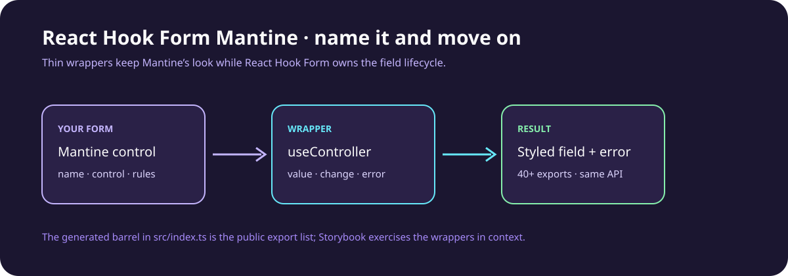

# React Hook Form Mantine

## Give Mantine fields a name—and let React Hook Form do the wiring.

[](https://github.com/aranlucas/react-hook-form-mantine/actions/workflows/ci.yml)
[](https://aranlucas.github.io/react-hook-form-mantine)
[](LICENSE)

React Hook Form Mantine wraps Mantine inputs with React Hook Form’s controller model. Add `name` and `control` to a familiar Mantine component, keep Mantine’s props, and get field values and validation errors without hand-writing the same adapter in every form.



_A source-level sketch of the wrapper contract._

## The five-minute win

```tsx
import { useForm } from "react-hook-form";
import { TextInput } from "react-hook-form-mantine";

type Profile = { displayName: string };

export function ProfileForm() {
  const { control, handleSubmit } = useForm<Profile>();

  return (
    <form onSubmit={handleSubmit(console.log)}>
      <TextInput
        name="displayName"
        control={control}
        label="Display name"
        rules={{ required: "Give yourself a name" }}
      />
      <button type="submit">Save profile</button>
    </form>
  );
}
```

The wrapper forwards Mantine’s UI props, passes `rules` to `useController`, and displays the field error through Mantine’s `error` prop. The same pattern scales from a text input to a date picker, slider, select, or grouped control.

## Controller lifecycle

Custom `onChange` and `onBlur` callbacks run alongside React Hook Form's handlers,
so blur still marks the field touched and runs `mode: "onBlur"` validation.
`disabled` is passed to the controller as well as the Mantine control: disabled
field values are omitted from submitted data, following React Hook Form semantics.
Use `readOnly` where supported if a non-editable value should still be submitted.

## Install

```bash
pnpm add react-hook-form-mantine react-hook-form @mantine/core @mantine/dates dayjs
```

The published package is ESM (`4.0.1`). Its peer dependencies are:

| Package           | Supported version |
| ----------------- | ----------------- |
| `@mantine/core`   | `^9.0.0`          |
| `@mantine/dates`  | `^9.0.0`          |
| `react`           | `^19.0.0`         |
| `react-dom`       | `^19.0.0`         |
| `react-hook-form` | `^7.43`           |

## What is covered

The package exports wrappers for Mantine text and password inputs, textarea, number and mask inputs, checkbox/radio/switch/chip groups, select/autocomplete/multi-select, color and JSON inputs, date/month/year/time pickers, sliders, rating, segmented control, tags, file and PIN inputs, and related groups. The generated barrel at [`src/index.ts`](src/index.ts) is the complete export list.

Try the full form in [`example/src/App.tsx`](example/src/App.tsx), browse the [deployed demo](https://aranlucas.github.io/react-hook-form-mantine), or inspect the Storybook stories in `src/**/*.stories.tsx`.

## Development

```bash
corepack enable
pnpm install --frozen-lockfile
pnpm typecheck
pnpm lint
pnpm format
pnpm test --run
pnpm build
```

`pnpm format` is the repository’s check command; `pnpm format:fix` writes formatting. Use `pnpm storybook` to explore the component stories locally and `pnpm build-storybook` to produce the static Storybook build. CI runs formatting, linting, type checking, tests, and the library build on Node 24.

## Source map

| Path               | Responsibility                                                          |
| ------------------ | ----------------------------------------------------------------------- |
| `src/<Component>/` | Mantine wrapper, tests, and Storybook story for each control.           |
| `src/index.ts`     | Generated public export barrel.                                         |
| `example/`         | Vite demo form exercising the wrappers together.                        |
| `.storybook/`      | Mantine provider, React Hook Form context, and Storybook configuration. |
| `vite.config.ts`   | Library and declaration build configuration.                            |

## Status and license

Version 4.0.1 is published from this repository through the release workflow. The package is licensed under the [MIT License](LICENSE). Changes to Mantine or React Hook Form peer APIs should be checked against the supported ranges above.
